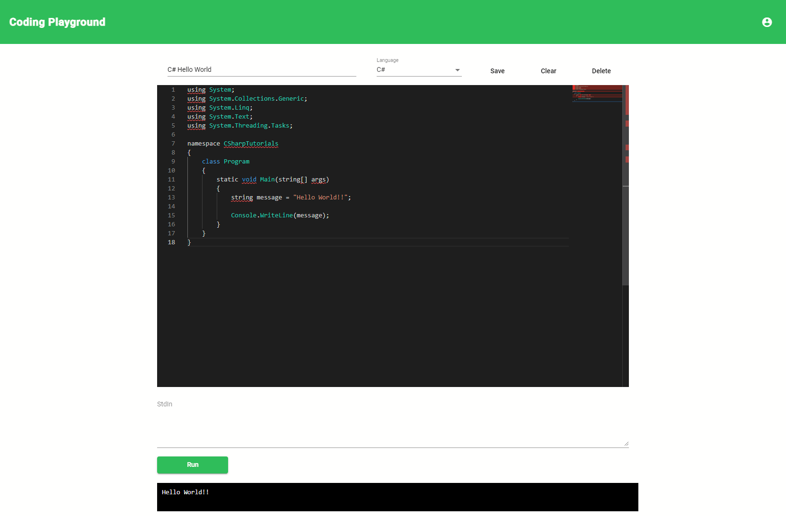

# Welcome to Coding Playground

<center>(M)ongoDB (E)xpress (A)ngular (N)odeJS</center>


# Steps to clone this project

1. Clone Repository
    ```sh
    git clone https://lab.skynetinc.tech/WorldDrknss/Code.Playground.git
    ```

2. `cd` into the cloned repository
    ```sh
    cd Code.Playgroud
    ``` 

3. Install dependencies
    ```sh
    cd client && npm install
    cd ../API && npm install
    ```

4. Update API/app.js
    * Obtain API access to [jdoodle](https://jdoodle.com): Add clientId and clientSecret information
    ```js
    reqObj['clientId'] = "";
    reqObj['clientSecret'] = "";
    ```
    * Connect [MongoDB](https://www.mongodb.com/): Replace `<ConnectionURL>` with your connection string and DB name.
    ```js
    mongoose.connect('<ConnectionURL>',{useNewUrlParser:true, useUnifiedTopology:true})
    ```
5. Run Servers
    * Inside the `client` directory
    ```sh
    npm start
    ```

    * Inside the `API` directory
    ```sh
    nodemon -L app.js
    ```
    

# Technologies 🔥

 - HTML
 - CSS
 - MongoDB
 - Express
 - Angular
 - NodeJS
  
# Objective‼

 Build a dynamic web application that allows users to interact with programming languages through a front-end interface.
# Features ✨
* Account Creation and Login Pages
* Encrypted Passwords
* Saves your coding workspaces
* Test your code within the browser